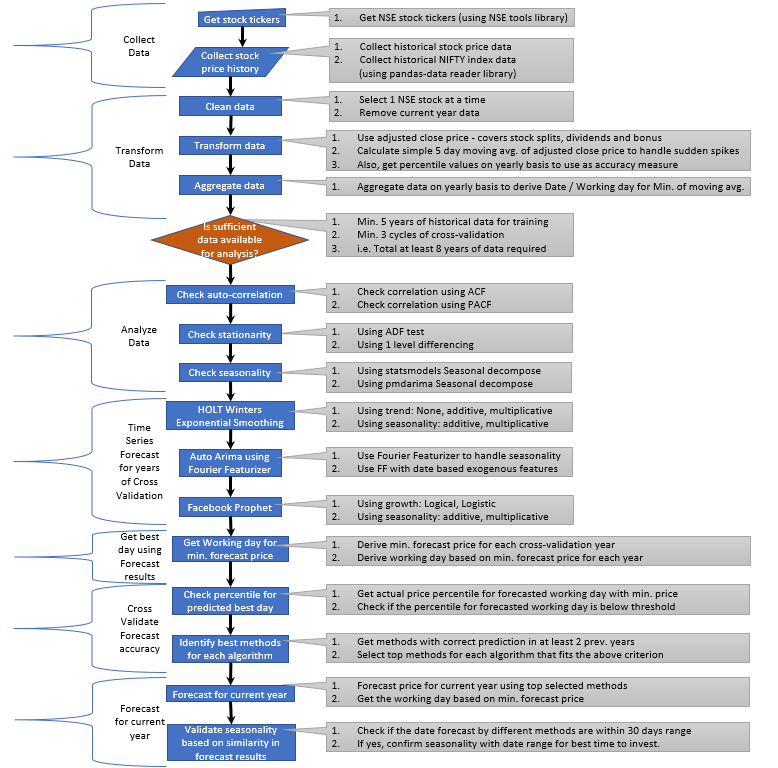

# Stock Seasonality
#### Predict the best time of the year to invest in a specific seasonal stock of Indian stock market (NSE)

## Objective
There are a lot of companies in Indian stock market which have a seasonality attached to their stock price movements. Investment decisions for such stocks can be improvised by studying the seasonality factor and identifying the best time period for investing in such stocks. While a simple statistical analysis may suffice, it may miss-out on some of the important aspects of seasonality. My objective is to use different methodologies and algorithms to identify a suitable approach for predicting the best time of the year for investment in a specific stock based on historical price trends. 

However, there could be unprecedented scenarios like COVID outbreak, but the same can be discarded as a one-off event for this analysis. 

## Target Audience

My target audience will be any Indian stock market investor who wants to invest in a stock based on inherent seasonality caused by the business domain in which the stock company operates. On a wider scale, this analysis can help any stock market investor interested in checking for seasonality as one of the factors before making an investment decision. 

## The Data

As of today, there are around 5000 companies listed on BSE and about 1600 companies listed on NSE. For the capstone project, I will restrict my analysis to NSE. All the data used in the project is pulled using the finance APIs exposed by pandas-datareader library. 

I will be collecting the data for day open, high, low. close and adjusted close stock price of last 30 years for all the stocks listed on NSE + NIFTY index. However, my analysis is based on adjusted close price. 

## Scope 

1. As of now, I plan to conduct this analysis on calendar year basis. In future, I plan to extend this on rolling monthly/quarterly basis based on the date of analysis.
2. As of now, I will restrict the scope to identifying the best time to buy. Plan to extend the implementation to get the best time for sale based on similar logic.

## Statistical considerations
1. Since this is stock price data, it is subject to adjustments caused by stock split, merger, dividends and bonus. Hence, I will be using a suitable Finance API which provides the correct adjusted close price data.
2. Since there could be a sudden dip/surge in stock price on a particular day, I will be using 5-day moving average as reference.
3. Since stock market is closed on weekends and holidays, will convert the date into working day index beginning at the start of calendar year for seamless analysis.

## Approach

## Constraints

1.	Since I am relying on publicly available Finance APIs, in future I might have to change the ref. API if the Open Source provider stops supporting the API.
2.	Due to time constraints I will restrict my analysis to following time series algorithms.
  +  a.  Holt-Winters Exponential Smoothing (Statsmodels)
  +  b.  ARIMAX using Auto-ARIMA from pmdarima
  +  c.  Facebook's Prophet library

## Deliverables

Code is saved in this repository.

+  DB - Sample DB is stored under /db directory
+  Notebooks - Reference notebooks used for preliminary analysis are saved under /notebooks directory
+  Capstone Rubrics - All the required project collaterals are saved under /notebooks directory

### Python Modules
1. Collector - Collect stock historical price raw data
2. Analyzer - Transform data and analyze for Seasonality
3. Flask Web App – Web app to display the outcome of analysis

### Web App
The UI is hosted on AWS Elastic beanstalk free tier:
http://stockseason-env.eba-gdnjade5.ap-south-1.elasticbeanstalk.com/
